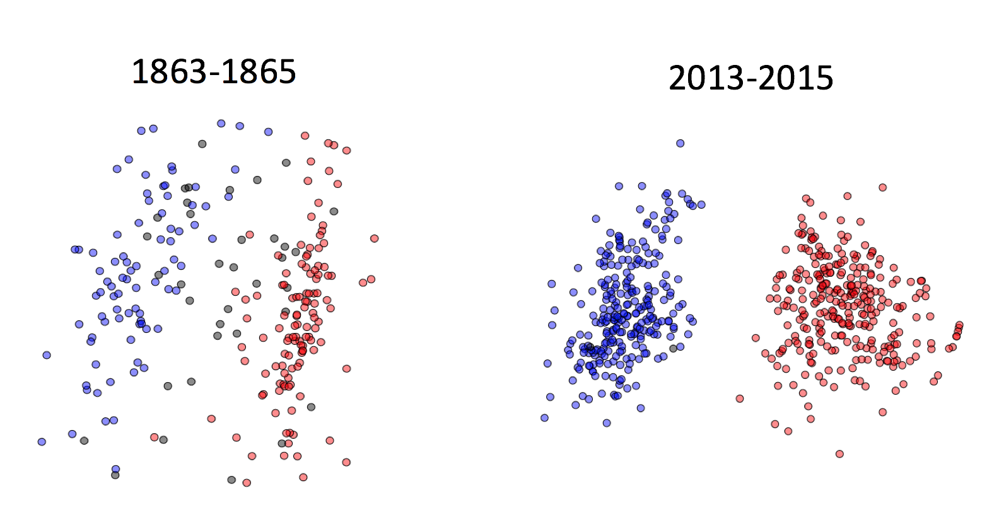
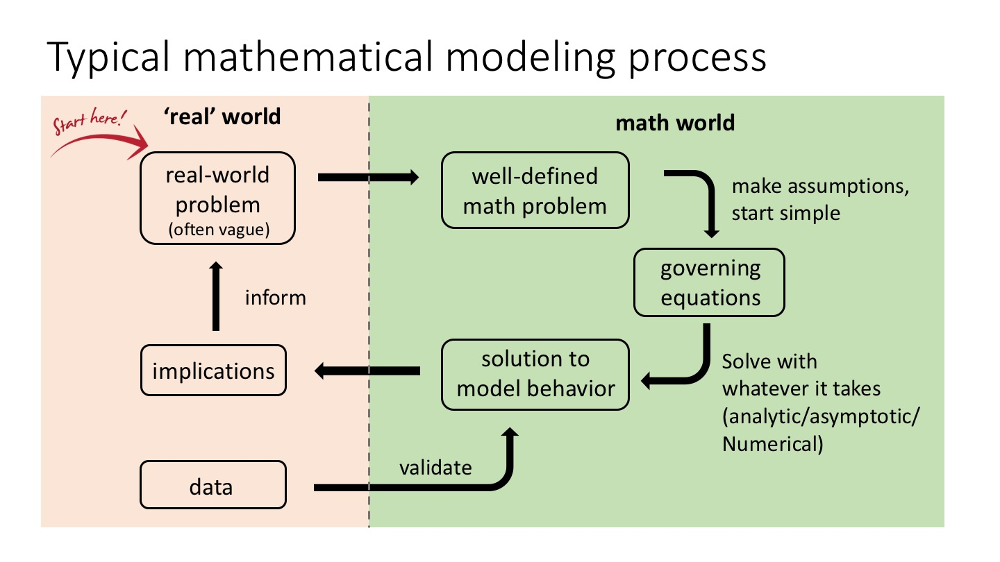

<!-- 
--> 

Here are some articles I generated as side projects. I share them here hoping they can be of use to others. You are welcome to share and use the information here. Please credit this website when doing so. 

-----

### [Visualizing the US congress](/vis_congress/)

This is a visualization I made of the congress member's positions, reduced to 2 dimensions, using the [DW-NOMINATE method](https://en.wikipedia.org/wiki/NOMINATE_(scaling_method)).

 
 
  
 
-----

### [Math modeling flowchart](/model_flowchart/)

 
 
  

